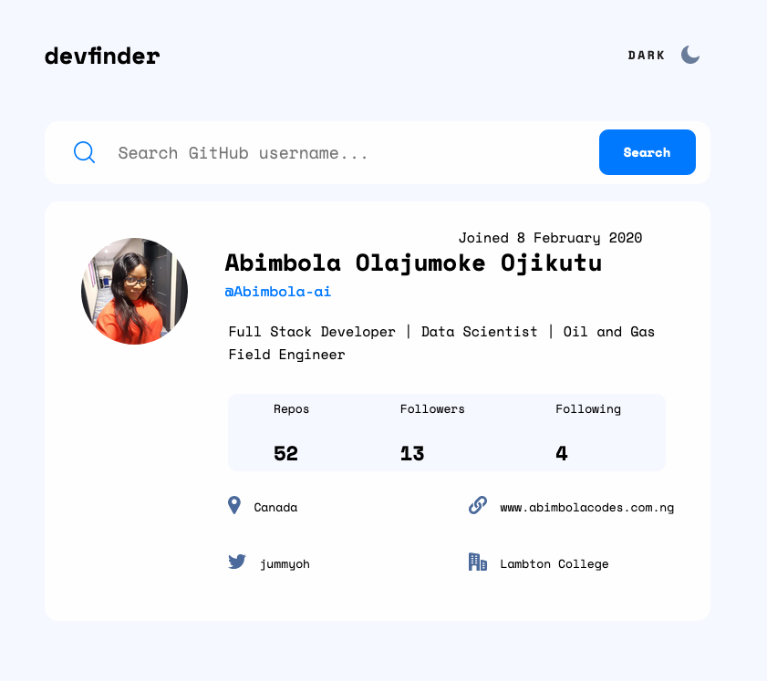
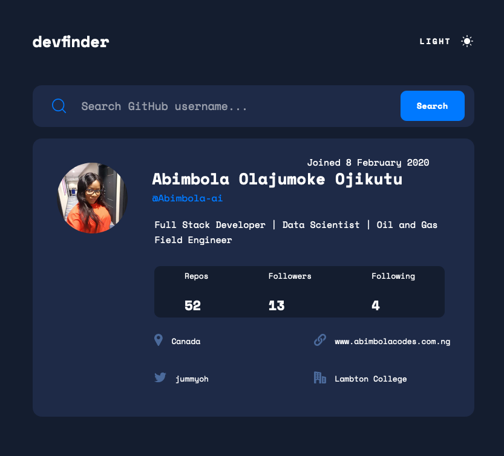

# Frontend Mentor - GitHub user search app solution

This is a solution to the [GitHub user search app challenge on Frontend Mentor](https://www.frontendmentor.io/challenges/github-user-search-app-Q09YOgaH6). Frontend Mentor challenges help you improve your coding skills by building realistic projects.

## Table of contents

- [Overview](#overview)
  - [The challenge](#the-challenge)
  - [Screenshot](#screenshot)
  - [Links](#links)
- [My process](#my-process)
  - [Built with](#built-with)
  - [What I learned](#what-i-learned)
  - [Continued development](#continued-development)
  - [Useful resources](#useful-resources)
- [Author](#author)
- [Acknowledgments](#acknowledgments)

## Overview

### The challenge

Users should be able to:

- View the optimal layout for the app depending on their device's screen size
- See hover states for all interactive elements on the page
- Search for GitHub users by their username
- See relevant user information based on their search
- Switch between light and dark themes
- Make the application responsive for all device types.

### Screenshot

### Links

- Solution URL: https://github.com/Abimbola-ai/github-user-search-app
- Live Site URL: https://abimbola-ai.github.io/github-user-search-app/

## My process

### Built with

- Semantic HTML5 markup
- CSS custom properties
- Flexbox
- CSS Grid
- Mobile-first workflow

### What I learned

* Use Javascript to connect to an api.
* Style for different viewport
* Use git to work, branch and commit to a project
* Comment effectively and write clean code.
* Use of flex and positioning in css

### Continued development

* Have the correct color scheme chosen for them based on their computer preferences. _Hint_: Research `prefers-color-scheme` in CSS.

## Author

- Website -[Olajumoke Ojikutu](https://www.abimbolacodes.com.ng)
- Frontend Mentor - [@Abimbola-ai](https://www.frontendmentor.io/profile/yourusername)
- LinkedIn - [ojikutu-olajumoke](https://www.https://www.linkedin.com/in/ojikutu-olajumoke/)

## Acknowledgments

A big thanks to [Frontend Mentor](https://www.linkedin.com/company/frontend-mentor/) for providing a platform to challenge and enhance my abilities. It's a fantastic community for aspiring developers, and I highly recommend giving their challenges a try!
